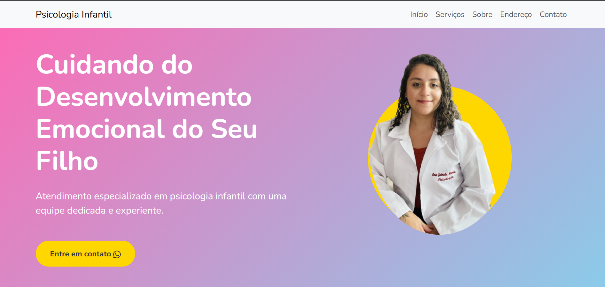

# Psicologia Infantil - Landing Page

## 📋 Sobre o Projeto
Landing page desenvolvida para uma clínica de psicologia infantil, com foco em apresentar os serviços oferecidos de forma acolhedora e profissional.

## 🛠️ Tecnologias Utilizadas

- **HTML5** - Estruturação da página
- **CSS3** - Estilização e responsividade
- **JavaScript** - Interatividade e animações
- **Bootstrap 5** - Framework CSS para design responsivo
- **Google Fonts (Nunito)** - Tipografia

## 🌟 Características Principais

- Design responsivo para todos os dispositivos
- Paleta de cores suave e acolhedora
- Seções bem definidas:
  - Hero section com chamada principal
  - Serviços oferecidos
  - Depoimentos de clientes
  - Integração com Instagram
  - Localização com Google Maps
  - Formulário de contato

## 💡 Pontos de Destaque

1. **Otimização para SEO**
   - Meta tags otimizadas
   - Estrutura semântica HTML

2. **Performance**
   - Arquivos CSS e JavaScript separados
   - Carregamento otimizado de recursos

3. **Experiência do Usuário**
   - Navegação suave com smooth scroll
   - Animações sutis nos cards de serviços
   - Botão de WhatsApp para contato rápido

4. **Acessibilidade**
   - Contraste adequado de cores
   - Estrutura semântica
   - Textos legíveis

## 📱 Responsividade

O site é totalmente responsivo, adaptando-se a diferentes tamanhos de tela:
- Desktop (1200px+)
- Tablet (768px - 1199px)
- Mobile (até 767px)

## 🔧 Estrutura do Projeto

## 📸 Screenshots

### Desktop

### Mobile

## 🔄 Atualizações Futuras Planejadas

- [ ] Adicionar modo escuro
- [ ] Implementar blog integrado
- [ ] Adicionar sistema de agendamento online
- [ ] Melhorar animações de transição

---

⌨️ Desenvolvido com ❤️